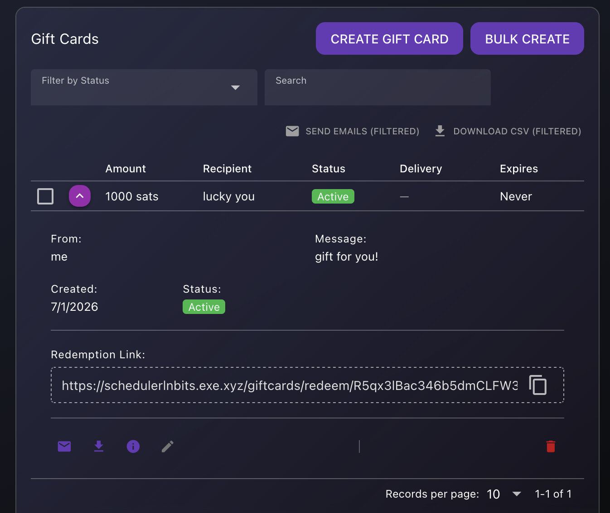
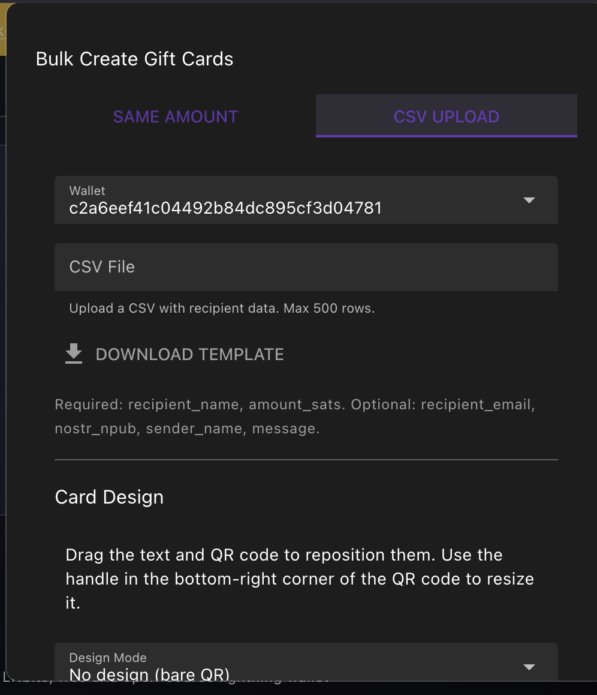
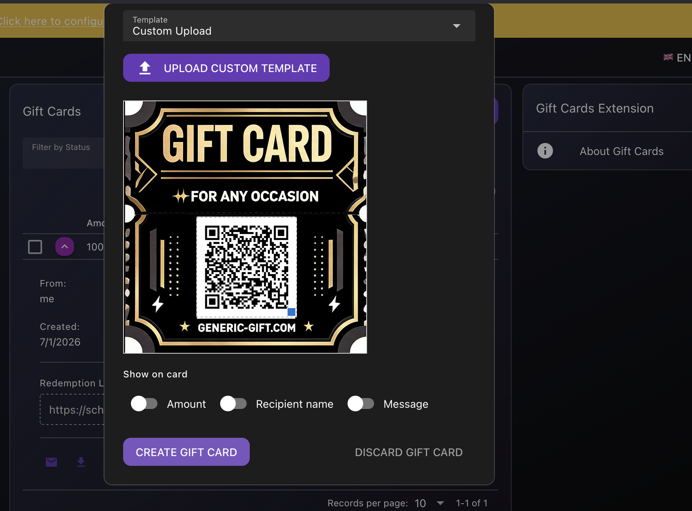
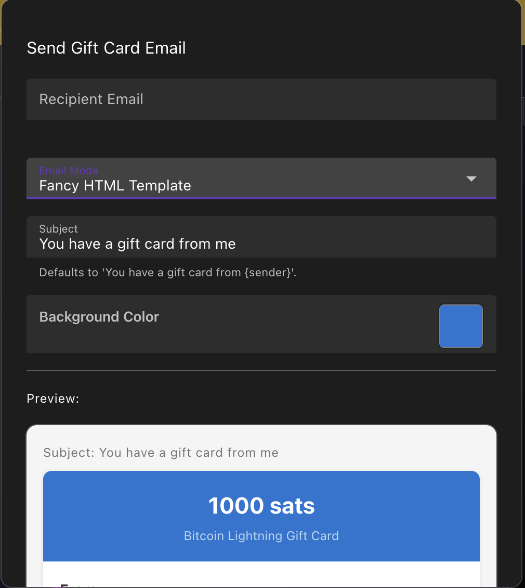
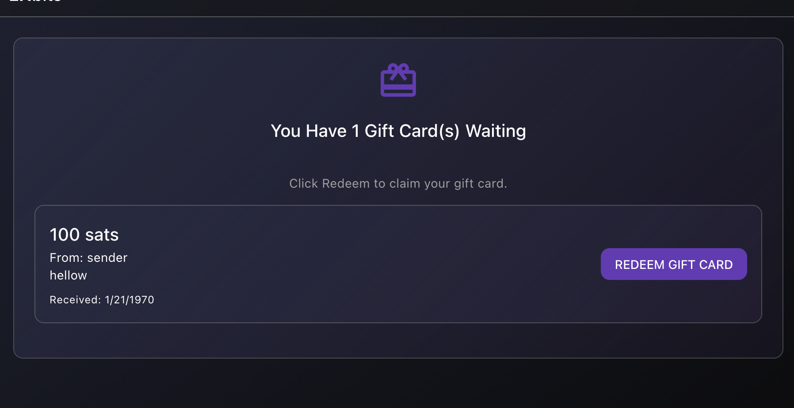

# LNbits Gift Cards Extension

Create and redeem sats-denominated gift cards with unique, secure redemption links.


## Overview

The Gift Cards extension lets LNbits wallet holders create, customize, distribute, and redeem Bitcoin Lightning gift cards denominated in sats. Gift cards can be designed individually or in bulk, delivered via email or printable QR images, and expired automatically if not claimed.

### Features

- **Single & bulk creation** — Create one card or hundreds via CSV upload
- **Custom card design** — Drag-and-drop QR/text placement, font controls, color pickers, portrait/landscape templates, or upload your own template image
- **Secure redemption** — Each card gets a unique, unguessable token and shareable link; recipients redeem by scanning a QR code with any Lightning wallet
- **Email delivery** — Send branded gift card images directly to recipients via email
- **Printable PNG** — Download high-resolution (3x) card images for manual distribution
- **Expiration & auto-refund** — Set expiration dates; unclaimed sats are automatically returned to the issuer wallet
- **Issuer dashboard** — Filter, search, and manage all cards with bulk actions (email, CSV export, delete)
- **REST API** — Full CRUD API for integration with external systems

## Screenshots

### Dashboard



### Create Gift Card



### Card Design Editor



### Send Email



### Redemption Page



### Card Templates

Portrait (425x650) | Landscape (1050x600)
:---: | :---:
 | 

## Installation

This extension is installed like any other LNbits extension. It is compatible with LNbits v0.10+.

### From the LNbits UI

1. Go to **Manage Extensions** in your LNbits instance
2. Find **Gift Cards** in the extension list
3. Click **Install**

### Manual installation

```bash
cd lnbits/lnbits/extensions
git clone https://github.com/bitkarrot/giftcards.git
```

Restart your LNbits server.

## Usage

### Creating a single gift card

1. Open the **Gift Cards** extension from your LNbits wallet
2. Click **Create Gift Card**
3. Enter the sats amount, recipient name, sender name, and an optional personal message
4. Optionally set an expiration date
5. Choose a design mode:
   - **No design (bare QR)** — A simple QR code on a white background
   - **Custom design** — Pick a portrait/landscape template or upload your own, then drag the QR code and text to position them
6. Click **Create** — the sats are deducted from your wallet and locked into the gift card

### Bulk creation

1. Click **Bulk Create**
2. **Same Amount tab** — Create N cards with the same sats value in one transaction
3. **CSV tab** — Upload a CSV with columns for recipient name, sats amount, email, and optional per-row design fields (up to 500 rows)

### Delivering a gift card

- **Email** — Click the email button on any card to send a branded image with the redemption link
- **Printable PNG** — Download a 3x-resolution PNG for printing or manual sharing
- **Share link** — Copy the redemption URL and send it through any channel

### Redeeming

Recipients open the redemption link (or scan the QR code) and are presented with the card value and sender's message. They scan the QR with any Lightning wallet to claim the sats directly into their wallet. No LNbits account required.

### Managing cards

The dashboard supports:
- **Filtering** by status (active, redeemed, expired), search text, and date range
- **Multi-select** with bulk actions: send emails, download CSV, delete selected cards
- **Edit** card metadata and design at any time (amount is locked; cancel and recreate to change it)
- **Delete** cards with automatic sats reclaim for active cards

## API

All endpoints are scoped to the authenticated wallet and require an admin or invoice key.

| Method | Endpoint | Description |
|--------|----------|-------------|
| `POST` | `/giftcards/api/v1/cards` | Create a single gift card |
| `POST` | `/giftcards/api/v1/cards/bulk` | Create multiple gift cards (same-amount or CSV) |
| `POST` | `/giftcards/api/v1/cards/validate-csv` | Validate a CSV file before bulk creation |
| `GET` | `/giftcards/api/v1/cards` | List all gift cards for the wallet |
| `GET` | `/giftcards/api/v1/cards/{card_id}` | Get gift card details |
| `PUT` | `/giftcards/api/v1/cards/{card_id}` | Update card metadata and/or design |
| `DELETE` | `/giftcards/api/v1/cards/{card_id}` | Delete a card (reclaims sats for active cards) |
| `DELETE` | `/giftcards/api/v1/cards/bulk` | Delete multiple cards in bulk |
| `GET` | `/giftcards/api/v1/cards/{card_id}/print` | Download printable PNG (3x resolution) |
| `POST` | `/giftcards/api/v1/cards/{card_id}/deliver` | Send card via email |
| `GET` | `/giftcards/api/v1/public/{token_hash}` | Public card info for redemption page |
| `GET` | `/giftcards/api/v1/{token_hash}/image` | Public card image for redemption page |

### Example: Create a gift card

```bash
curl -X POST https://your-lnbits.com/giftcards/api/v1/cards \
  -H "X-Api-Key: YOUR_ADMIN_KEY" \
  -H "Content-Type: application/json" \
  -d '{
    "amount": 1000,
    "recipient_name": "Bob",
    "sender_name": "Alice",
    "message": "Happy birthday!",
    "expires_at": "2026-12-31T23:59:59Z"
  }'
```

### Example: List all cards

```bash
curl https://your-lnbits.com/giftcards/api/v1/cards \
  -H "X-Api-Key: YOUR_INVOICE_KEY"
```

## Tech Stack

- **Backend**: Python, FastAPI/Starlette (LNbits extension framework)
- **Frontend**: Vue 3, Quasar UI components
- **Database**: SQLite via LNbits DB layer
- **Image rendering**: Pillow (PIL) for QR overlay and card image generation
- **QR codes**: qrcode library

## License

MIT
